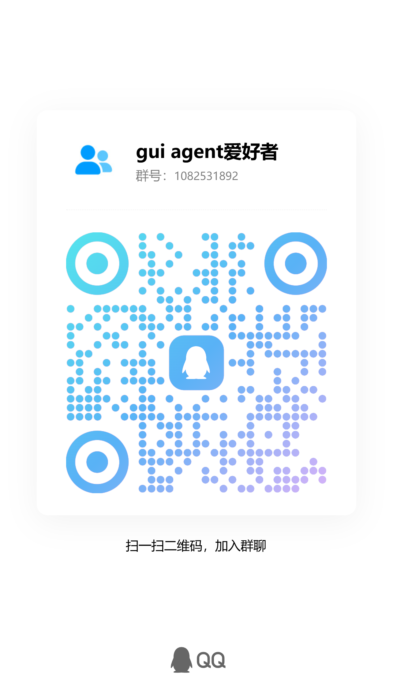

# scrcpy-py-ddlx

A pure Python client implementation based on the [scrcpy](https://github.com/Genymobile/scrcpy) protocol, allowing you to mirror and control Android devices in high definition on your computer. Built-in MCP server enables seamless integration with AI tools like [StepFun Desktop Assistant](https://www.stepfun.com/download), suitable for automation testing, remote control, and AI-assisted operations.

[](https://www.python.org/) [](LICENSE) [](https://www.microsoft.com/windows) []()

English | [中文](README.md)

---

## Features

- 🎥 **HD Mirroring** - H.264/H.265 codec, 4K 60fps, GPU accelerated rendering
- 🔊 **Audio Streaming** - OPUS codec, supports playback and recording
- 🌐 **Multiple Connection Modes** - USB / WiFi / Direct Network (TCP/UDP)
- 🤖 **AI Control** - MCP server, supports [StepFun Desktop Assistant](https://www.stepfun.com/download)
- 📋 **Clipboard Sync** - Bidirectional sync between PC and device
- 📁 **File Transfer** - Fast transfer between device and PC
- 🖱️ **Full Control** - Touch, keyboard, scroll, text input

---

## StepFun Desktop Assistant

[StepFun Desktop Assistant](https://www.stepfun.com/download) is a desktop AI Agent launched by StepFun, known as "China's Claude Cowork".

### Core Features

| Feature | Description |
|---------|-------------|
| **Natural Language Control** | Control computer with natural language, auto-execute complex tasks |
| **Local File Operations** | Smart naming, categorization, file organization |
| **Web Browsing** | Auto-visit websites, extract info, generate reports |
| **MCP Protocol** | Call Excel, Feishu, Email and 16+ tools |
| **Miaoji System** | Save common commands, one-click reuse, community sharing |

### Integration with This Project

This project provides MCP server. After installing StepFun Desktop Assistant, configure MCP to let AI automatically control your phone:

```
AI sends command → MCP server → scrcpy-py-ddlx → Android device
```

**Capabilities:**
- Screenshot recognition
- Auto tap, swipe operations
- File transfer management
- App launch and control

### Download

- **Website**: https://www.stepfun.com/download
- **Support**: Windows / macOS
- **Cost**: Free

---

**Quick Navigation**: [Quick Start](#quick-start) · [Entry Scripts](#entry-scripts) · [Pre-built Files](#pre-built-files) · [Dependencies](#dependencies) · [StepFun Desktop Assistant](#stepfun-desktop-assistant) · [Documentation](#documentation) · [AI Integration](#ai-integration)

---

## Quick Start

### System Requirements

| Item | Requirement |
|------|-------------|
| **OS** | Windows 10/11 ✅ / Linux / macOS (theoretically supported, not yet adapted) |
| **Python** | 3.10 or higher |
| **Android** | API 21+ (Android 5.0+) |
| **ADB** | Android SDK Platform Tools |

> **Platform Compatibility**: This project has been thoroughly tested on Windows 10/11. Linux and macOS should theoretically work (core features use cross-platform libraries), but due to lack of testing hardware, they haven't been adapted and verified yet. Community contributions for other platforms are welcome.

### Installation

```bash
# 1. Create and enter directory
mkdir ddlx
cd ddlx

# 2. Create virtual environment
python -m venv venv
source venv/bin/activate  # Linux/macOS
# or
venv\Scripts\activate     # Windows

# 3. Clone the project
git clone https://github.com/AIddlx/scrcpy-py-ddlx.git .

# 4. Install dependencies
pip install -r requirements.txt
```

### Run Tests

```bash
# USB mode - simplest way
python tests_gui/test_direct.py

# Network mode - supports WiFi
python tests_gui/test_network_direct.py

# MCP server - AI control
python scrcpy_http_mcp_server.py
```

---

## Entry Scripts

This project provides three main entry scripts:

| Script | Purpose | Connection |
|--------|---------|------------|
| `tests_gui/test_direct.py` | Quick test / Development debugging | USB (ADB) |
| `tests_gui/test_network_direct.py` | Wireless mirroring / Remote control | WiFi (TCP/UDP) |
| `scrcpy_http_mcp_server.py` | AI control service | USB / WiFi |

### test_direct.py - USB Mode

Pure USB mode, the most stable connection:

```bash
# Basic usage
python tests_gui/test_direct.py

# Debug mode
python tests_gui/test_direct.py --log-level DEBUG
```

**Features:**
- Auto-detect USB connected devices
- Auto-push server to device
- Display video window, supports audio and clipboard

### test_network_direct.py - Network Mode

Supports WiFi wireless connection:

```bash
# One-time mode (server exits with client)
python tests_gui/test_network_direct.py

# Persistent mode (server keeps running)
python tests_gui/test_network_direct.py --stay-alive

# FEC error correction (weak network)
python tests_gui/test_network_direct.py --fec frame --fec-k 8 --fec-m 2
```

### scrcpy_http_mcp_server.py - MCP Server

HTTP MCP server for AI assistant to call:

```bash
# One-time mode (USB)
python scrcpy_http_mcp_server.py

# One-time mode (Network)
python scrcpy_http_mcp_server.py --net

# Persistent mode (Network, server keeps running)
python scrcpy_http_mcp_server.py --net --stay-alive

# Specify port
python scrcpy_http_mcp_server.py --port 3359

# Stop remote server (IP optional, auto-discover if not specified)
python scrcpy_http_mcp_server.py --stop-server
python scrcpy_http_mcp_server.py --stop-server 192.168.1.100
```

**MCP Tools:**

| Tool | Function |
|------|----------|
| `screenshot` | Capture screen screenshot |
| `tap` | Tap at specified coordinates |
| `swipe` | Swipe operation |
| `type_text` | Input text |
| `press_key` | Press key (HOME/BACK/etc.) |
| `get_device_info` | Get device information |
| `list_apps` | List installed apps |
| `start_app` | Launch app |
| `push_file` | Push file to device |
| `pull_file` | Pull file from device |

---

## Pre-built Files

The project includes pre-built files, **no compilation required**:

| File | Description |
|------|-------------|
| `scrcpy-server` | Android server (~90KB), auto-pushed to device |
| `scrcpy-companion.apk` | **Mobile management tool**, for network mode |

### scrcpy-companion.apk

After installing on your phone, provides these features:

| Feature | Description |
|---------|-------------|
| **Quick Tile** | Quick toggle in notification panel to terminate server |
| **Status View** | View server running status, ports, PID |
| **Log Viewer** | Real-time server log viewing |

**Use Cases:**
- In network mode, first push persistent server via USB (`--stay-alive`), then disconnect USB. Use companion on phone to view status or terminate server.
- For remote control, manage server without physical connection to phone.

**Installation:**
```bash
adb install scrcpy/companion/scrcpy-companion.apk
```

For self-compilation, see [Installation Guide](documentation/user/installation.md).

---

## Project Structure

```
scrcpy-py-ddlx/
├── scrcpy_py_ddlx/           # Python client package
│   ├── client/               # Connection, config, components
│   ├── core/                 # Core functionality
│   │   ├── decoder/          # Video/audio decoding
│   │   ├── demuxer/          # Packet parsing
│   │   ├── audio/            # Audio processing
│   │   └── file/             # File transfer
│   ├── gui/                  # Qt GUI components
│   └── mcp_server.py         # MCP service implementation
├── scrcpy/server/            # Java server source
├── scrcpy-server             # Pre-built server
├── scrcpy_http_mcp_server.py # MCP server entry
├── tests_gui/                # Test scripts
│   ├── test_direct.py        # USB mode test
│   └── test_network_direct.py # Network mode test
├── documentation/            # Documentation
│   ├── user/                 # User guides
│   ├── api/                  # API reference
│   └── dev/                  # Development docs
└── requirements.txt          # Python dependencies
```

---

## Dependencies

### Core Dependencies (Required)

```
av>=13.0.0        # Video/audio codec (PyAV)
numpy>=1.24.0     # Array operations
```

### GUI Dependencies

```
PySide6           # Qt6 GUI framework
PyOpenGL          # GPU accelerated rendering
```

### MCP Server

```
starlette         # HTTP framework
uvicorn           # ASGI server
```

### Audio Playback

```
sounddevice       # Audio output
```

### Windows Clipboard

```
pywin32           # Windows API
pyperclip         # Clipboard operations
```

---

## Documentation

| Document | Description |
|----------|-------------|
| [Quick Start](documentation/user/quickstart.md) | 5-minute guide |
| [Installation Guide](documentation/user/installation.md) | Complete installation |
| [MCP Server Guide](documentation/user/mcp-server-guide.md) | Server parameters |
| [API Reference](documentation/api/control.md) | Control methods |
| [Protocol Spec](documentation/dev/protocols/PROTOCOL_SPEC.md) | Communication protocol |
| [Troubleshooting](documentation/user/troubleshooting.md) | Common issues |

---

## AI Integration

This project supports [StepFun Desktop Assistant](https://www.stepfun.com/download) for AI control.

After downloading and installing, configure MCP and start the MCP server to let AI automatically control your phone.

See [StepFun MCP Integration Guide](documentation/user/integrations/jumpy-assistant.md) for details.

---

## Acknowledgments

- [scrcpy](https://github.com/Genymobile/scrcpy) - Original scrcpy project
- [PyAV](https://github.com/PyAV-Org/PyAV) - FFmpeg Python bindings
- [PySide6](https://www.pyside.org/) - Qt for Python

---

## License

MIT License

---

## Community

Join our community groups for discussion and support:

| scrcpy-py-ddlx QQ Group | StepFun Official Group |
|:-----------------------:|:----------------------:|
|  |  |
