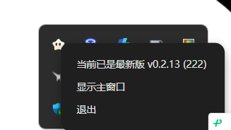
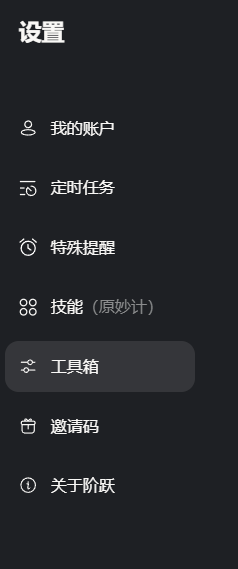
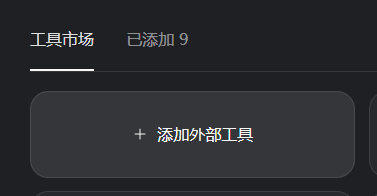
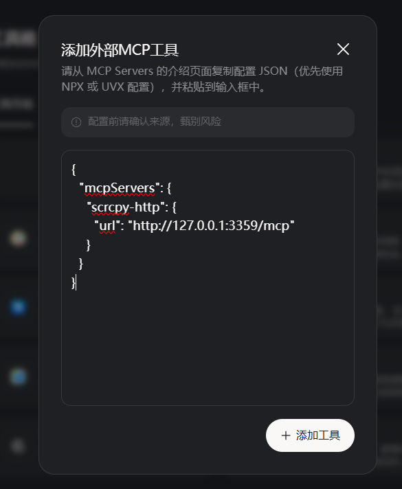
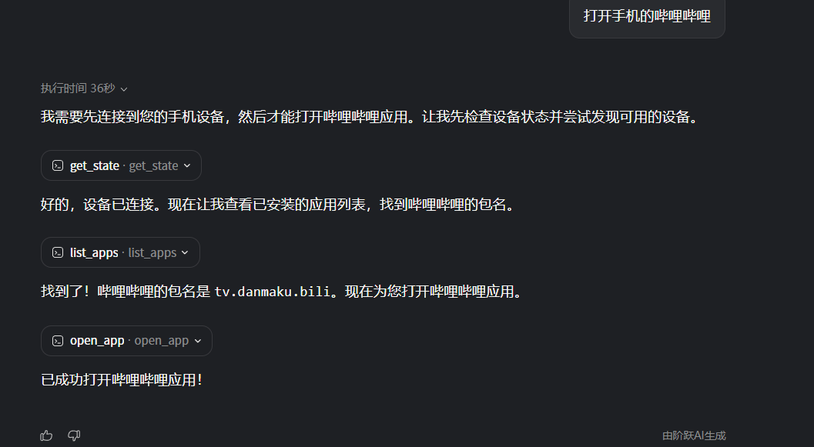

# 阶跃桌面助手 - MCP 集成指南

本文档介绍如何在阶跃桌面助手中添加 scrcpy-py-ddlx 的 MCP 工具。

## 工作原理

```
阶跃桌面助手 <---> HTTP MCP 服务器 <---> Android 设备
                    (localhost:3359)
```

1. 阶跃助手通过 MCP 协议连接到本地 HTTP 服务器
2. 服务器返回可用工具列表（`tools/list`）
3. 阶跃助手根据工具描述理解如何调用
4. 每次工具调用，服务器实时连接/控制设备

---

## 安装步骤

### 1. 克隆项目

```bash
mkdir ddlx && cd ddlx
git clone https://github.com/AIddlx/scrcpy-py-ddlx.git .
python -m venv venv
venv\Scripts\activate
pip install -r requirements.txt
```

### 2. 启动 MCP 服务器

```bash
# USB 模式（推荐）
python scrcpy_http_mcp_server.py --adb

# 网络模式（需先通过 USB 推送服务端）
python scrcpy_http_mcp_server.py --net

# 如需截图功能
python scrcpy_http_mcp_server.py --adb --video

# 如需录音功能
python scrcpy_http_mcp_server.py --adb --audio
```

服务器运行在 `http://127.0.0.1:3359/mcp`，**保持此窗口运行**。

> 详细参数参见 [MCP 服务器使用指南](../mcp-server-guide.md)

---

## 配置阶跃助手

### 步骤 1: 显示主窗口

电脑右下角"小跃"图标，**右键** → "显示主窗口"



### 步骤 2: 进入设置

主窗口**右上角**，**左键点击**圆形图标


### 步骤 3: 打开工具箱

设置页面中点击"**工具箱**"



### 步骤 4: 添加外部工具

点击"**添加外部工具**"



### 步骤 5: 配置 MCP

选择"**添加外部 MCP 工具**"，填写：

| 参数 | 值 |
|------|---|
| 名称 | `scrcpy` |
| URL | `http://127.0.0.1:3359/mcp` |



---

## 可用工具

阶跃助手连接后会自动获取工具列表，主要工具包括：

### 连接管理

| 工具 | 说明 |
|------|------|
| `connect` | 连接设备（USB 或网络模式） |
| `disconnect` | 断开连接 |
| `list_devices` | 列出已连接的 ADB 设备 |
| `get_state` | 获取当前状态（屏幕尺寸、方向等） |

### 控制操作

| 工具 | 说明 |
|------|------|
| `tap` | 点击坐标 |
| `swipe` | 滑动 |
| `press_key` | 按键（HOME/BACK/等） |
| `type_text` | 输入文字 |

### 应用管理

| 工具 | 说明 |
|------|------|
| `list_apps` | 列出已安装应用 |
| `start_app` | 启动应用 |
| `stop_app` | 停止应用 |

### 媒体功能

| 工具 | 说明 | 依赖参数 |
|------|------|----------|
| `screenshot` | 截图 | 启动时加 `--video` |
| `start_recording` | 开始录音 | 启动时加 `--audio` |
| `stop_recording` | 停止录音 | 启动时加 `--audio` |

### 文件操作

| 工具 | 说明 |
|------|------|
| `push_file` | 推送文件到设备 |
| `pull_file` | 从设备拉取文件 |

### 剪贴板

| 工具 | 说明 |
|------|------|
| `get_clipboard` | 获取设备剪贴板 |
| `set_clipboard` | 设置设备剪贴板 |

---

## 使用示例

添加 MCP 工具后，直接用自然语言与阶跃助手对话：

**连接设备（USB 模式）：**
```
通过 USB 连接手机
```

**连接设备（网络模式）：**
```
通过网络连接手机 192.168.1.100
```

**控制操作：**
```
截取屏幕截图
点击屏幕中央
打开哔哩哔哩
输入文字"你好"
```

**示例：打开哔哩哔哩**



执行流程：
1. AI 调用 `connect` 连接设备
2. 调用 `list_apps` 获取应用列表
3. 找到哔哩哔哩（包名：tv.danmaku.bili）
4. 调用 `start_app` 打开应用

---

## 常见问题

### 连接失败

- 确保 MCP 服务器已启动
- 检查端口 3359 未被占用
- USB 模式需确保 ADB 连接正常（`adb devices`）

### 网络模式连接失败

1. 先用 USB 线连接设备
2. 启动服务器时指定网络模式：
   ```bash
   python scrcpy_http_mcp_server.py --net
   ```
3. 或使用驻留模式推送服务端：
   ```bash
   python scrcpy_http_mcp_server.py --net --stay-alive
   ```

### 截图/录音功能不可用

启动服务器时添加对应参数：
```bash
# 启用截图
python scrcpy_http_mcp_server.py --adb --video

# 启用录音
python scrcpy_http_mcp_server.py --adb --audio

# 完整功能
python scrcpy_http_mcp_server.py --adb --video --audio
```
